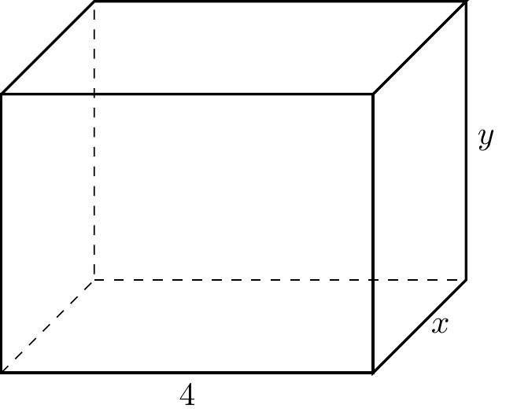
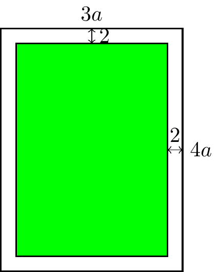
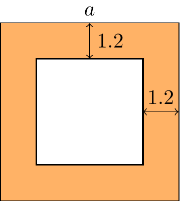

# Biểu Thức Số và Biểu Thức Đại Số

## Câu Hỏi Mở Đầu

Hai biểu thức $`3 \cdot 5^2 + 6 \div 2`$ và
$`2 \cdot x + 3 \cdot x^2 \cdot y`$ có gì khác nhau?

Trả lời: Biểu thức đầu chỉ chứa số (biểu thức số), biểu thức thứ hai
chứa cả chữ và số (biểu thức đại số).

## 1. Biểu Thức Số

### Ta đã biết

Các số được nối với nhau bởi dấu các phép tính cộng, trừ, nhân, chia,
nâng lên lũy thừa tạo thành một *biểu thức*.

#### Ví dụ

- $`3 + 7 - 2`$
- $`4 \cdot 5 \div 2`$
- $`2(5 + 8)`$
- $`2 \cdot 3^4 + 9`$
- $`5 \cdot 2^3 - 4 \cdot 3^2`$

#### Ví dụ 1

1)  Chu vi hình chữ nhật có chiều dài 6 cm và chiều rộng 4 cm:
    $`P = 2(6 + 4)`$

2)  Diện tích hình tròn có bán kính 5 cm: $`A = \pi \cdot 5^2`$

#### Thực hành 1

Hãy viết biểu thức số biểu thị diện tích của một hình thoi có các đường
chéo bằng 6 cm và 8 cm:

``` math
A = \frac{6 \times 8}{2}
```

## 2. Biểu Thức Đại Số

### Kiến thức trọng tâm

Biểu thức gồm các số và các chữ (đại diện cho số) được nối với nhau bởi
các kí hiệu phép toán cộng, trừ, nhân, chia, nâng lên lũy thừa được gọi
là *biểu thức đại số*.

Các chữ trong biểu thức đại số được gọi là *biến số* (hay gọi tắt là
*biến*).

#### Ví dụ 2

- $`6 \cdot x \cdot y - 2 \cdot x^2 \cdot y`$ và $`\dfrac{1}{x} - 2y`$
  là hai biểu thức đại số với hai biến là $`x`$ và $`y`$.
- $`a \cdot b + \dfrac{b^3}{6} + c`$ là biểu thức đại số với ba biến là
  $`a`$, $`b`$ và $`c`$.

### Quy ước

- Không viết dấu nhân giữa các chữ: $`ab`$ thay cho $`a \cdot b`$
- Không viết dấu nhân giữa số và chữ: $`6x`$ thay cho $`6 \cdot x`$
- Không viết thừa số 1: $`xy`$ thay cho $`1 \cdot xy`$
- Thừa số $`(-1)`$ thay bằng dấu trừ: $`-x`$ thay cho $`(-1) \cdot x`$
- Số viết trước chữ: $`4xy`$ thay cho $`xy \cdot 4`$

### Lưu ý

Trong biểu thức đại số:

- Người ta cũng dùng các dấu ngoặc để chỉ thứ tự thực hiện các phép
  tính.

- Vì biến đại diện cho số nên khi thực hiện các phép tính trên các biến,
  ta có thể áp dụng những tính chất, quy tắc phép tính như trên các số.
  Chẳng hạn:

  $`x + y = y + x`$

  $`x + (y + z) = (x + y) + z`$

  $`x(y + z) = xy + xz`$

  $`xy = yx`$

  $`x(yz) = (xy)z`$

  $`-x(y - z) = -xy + xz`$

#### Ví dụ 3

Viết biểu thức biểu thị diện tích toàn phần của hình hộp chữ nhật có ba
cạnh là 4 cm, $`x`$ cm và $`y`$ cm (Hình 2).

<!-- -->

Hình 2

Giải

Diện tích toàn phần của hình hộp chữ nhật nói trên là:

$`2 \cdot (4 + x) \cdot y + 2 \cdot (4 \cdot x) = 8y + 2xy + 8x = 8x + 8y + 2xy`$
(cm²).

Vậy biểu thức biểu thị diện tích toàn phần của hình hộp trên là
$`8x + 8y + 2xy`$ (cm²).

#### Ví dụ 4

Viết biểu thức biểu thị diện tích của hình chữ nhật có chiều dài hơn
chiều rộng 3 cm.

Giải

Gọi $`a`$ cm là chiều rộng của hình chữ nhật thì chiều dài của hình chữ
nhật bằng $`(a + 3)`$ cm.

Diện tích hình chữ nhật nói trên là: $`a \cdot (a + 3) = a^2 + 3a`$
(cm²).

Vậy biểu thức biểu thị diện tích của hình chữ nhật trên là $`a^2 + 3a`$
(cm²).

#### Ví dụ 5

Rút gọn các biểu thức sau:

1)  $`6x + 4x`$

2)  $`4(x + 2x) - (x^2 - 2x)`$

Giải

1)  
    ``` math
    6x + 4x = (6 + 4)x = 10x
    ```

2)  

#### Thực hành 2

1)  Hãy viết biểu thức biểu thị thể tích khối lập phương có cạnh bằng
    $`a`$: $`a^3`$

2)  Hãy viết biểu thức biểu thị diện tích hình thang có đáy lớn bằng
    $`a`$ cm, đáy nhỏ bằng $`b`$ cm, đường cao bằng $`h`$ cm:
    $`\dfrac{(a + b)h}{2}`$

### Vận dụng 1

Một khung ảnh hình chữ nhật với hai cạnh liên tiếp bằng $`3a`$ cm và
$`4a`$ cm với bề rộng bằng 2 cm (xem Hình 3). Viết biểu thức biểu thị
diện tích của tấm ảnh trong Hình 3.

<!-- -->

Hình 3

Giải

Diện tích tấm ảnh:

## 3. Giá Trị Của Biểu Thức Đại Số

### Kiến thức trọng tâm

Để tính giá trị của biểu thức đại số, ta thay các giá trị cho trước vào
biểu thức rồi thực hiện các phép tính.

#### Ví dụ

Cho biểu thức $`x^2 - 2xy + 1`$.

Khi thay $`x = 3`$ và $`y = 1`$ vào biểu thức, ta được:
$`3^2 - 2 \cdot 3 \cdot 1 + 1 = 4`$.

Ta nói: 4 là giá trị của biểu thức $`x^2 - 2xy + 1`$ khi $`x = 3`$ và
$`y = 1`$,

hoặc khi $`x = 3`$ và $`y = 1`$ thì giá trị của biểu thức
$`x^2 - 2xy + 1`$ là 4.

#### Ví dụ 6

Tính giá trị của biểu thức $`a^2 - 5b + 1`$ khi $`a = 4`$ và $`b = 2`$.

Giải

Thay $`a = 4`$ và $`b = 2`$ vào biểu thức trên, ta được:
$`4^2 - 5 \cdot 2 + 1 = 7`$.

Vậy khi $`a = 4`$ và $`b = 2`$ thì giá trị của biểu thức
$`a^2 - 5b + 1`$ là 7.

#### Ví dụ 7

Tính giá trị của biểu thức $`2[(a - b)^2 \div c]`$ khi $`a = 13`$,
$`b = 7`$ và $`c = 3`$.

Giải

Thay $`a = 13`$, $`b = 7`$ và $`c = 3`$ vào biểu thức trên, ta được:

``` math
 2[(13 - 7)^2 \div 3] = 2(6^2 \div 3) = 2(36 \div 3) = 2 \cdot 12 = 24 
```

Vậy giá trị của biểu thức trên khi $`a = 13`$, $`b = 7`$ và $`c = 3`$ là
24.

#### Thực hành 3

Tính giá trị của $`3x^2 - 4x + 2`$ khi $`x = 2`$.

Giải

Thay $`x = 2`$ vào biểu thức trên, ta được:

Vậy giá trị của biểu thức trên khi $`x = 2`$ là 6.

### Vận dụng 2

Cho biết giá bán của một đôi giày bằng $`C + Cr`$, trong đó $`C`$ là giá
gốc và $`r`$ là thuế giá trị gia tăng.

Tính giá bán của đôi giày khi $`C = 600`$ nghìn đồng và $`r = 10\%`$.

Giải

## Bài Tập

### Bài 1

Viết biểu thức số biểu thị diện tích xung quanh hình hộp chữ nhật có
chiều dài 7 cm, chiều rộng 4 cm, chiều cao 2 cm

Giải

``` math
2(7 + 4) \times 2
```

### Bài 2

Viết biểu thức đại số biểu thị chu vi hình chữ nhật có chiều dài hơn
chiều rộng 7 cm

Giải

Gọi $`x`$ (cm) là chiều rộng

Chiều dài: $`x + 7`$ (cm)

Chu vi:
``` math
2[x + (x + 7)] = 2(2x + 7) = 4x + 14 \text{ (cm)}
```

### Bài 3

Viết biểu thức đại số biểu thị thể tích hình hộp chữ nhật có chiều dài
hơn chiều rộng 4 cm và hơn chiều cao 2 cm

Giải

Gọi $`x`$ (cm) là chiều cao

Chiều rộng: $`x + 2`$ (cm)

Chiều dài: $`x + 4`$ (cm)

Thể tích:
``` math
x(x + 2)(x + 4) \text{ (cm}^3\text{)}
```

### Bài 4

Viết biểu thức đại số biểu thị

1)  Tổng của $`x^2`$ và $`3y`$
2)  Tổng các bình phương của $`a`$ và $`b`$

Giải

1)  $`x^2 + 3y`$
2)  $`a^2 + b^2`$

### Bài 5

Lan có $`x`$ nghìn đồng, chi $`y`$ nghìn đồng, được cho thêm $`z`$ nghìn
đồng. Viết biểu thức và tính khi $`x = 100`$, $`y = 60`$, $`z = 50`$

Giải

Biểu thức: $`x - y + z`$ (nghìn đồng)

Khi $`x = 100`$, $`y = 60`$, $`z = 50`$:

``` math
100 - 60 + 50 = 90 \text{ (nghìn đồng)}
```

### Bài 6

Rút gọn

1)  $`6(y - x) - 2(x - y)`$
2)  $`3x^2 + x - 4x - 5x^2`$

Giải

1)  

``` math

6(y - x) - 2(x - y) = 6y - 6x - 2x + 2y = 8y - 8x
```

2)  
    ``` math
    3x^2 + x - 4x - 5x^2 = -2x^2 - 3x
    ```

### Bài 7

Mảnh vườn hình vuông cạnh $`a`$ (m), lối đi xung quanh rộng 1,2 m. Viết
biểu thức diện tích còn lại và tính khi $`a = 20`$

<!-- -->

Hình 5

Giải

Cạnh phần còn lại:
``` math
a - 2(1{,}2) = a - 2{,}4 \text{ (m)}
```

Biểu thức diện tích còn lại:
``` math
(a - 2{,}4)^2 \text{ (m}^2\text{)}
```

Biểu thức diện tích còn lại khi $`a = 20`$:
``` math
(20 - 2{,}4)^2 = (17{,}6)^2 = 309{,}76 \text{ (m}^2\text{)}
```

### Bài 8

Lương tháng năm thứ $`n`$: $`C(1 + 0{,}04)^n`$ với $`C = 5`$ triệu đồng.
Tính lương năm 2020 ($`n = 5`$)

Giải

## Sau bài học này, em đã làm được những gì?

- Nhận biết được biểu thức số và biểu thức đại số.
- Viết được biểu thức đại số biểu diễn các đại lượng quen thuộc trong
  hình học hay trong đời sống.
- Tính được giá trị của một biểu thức đại số.
